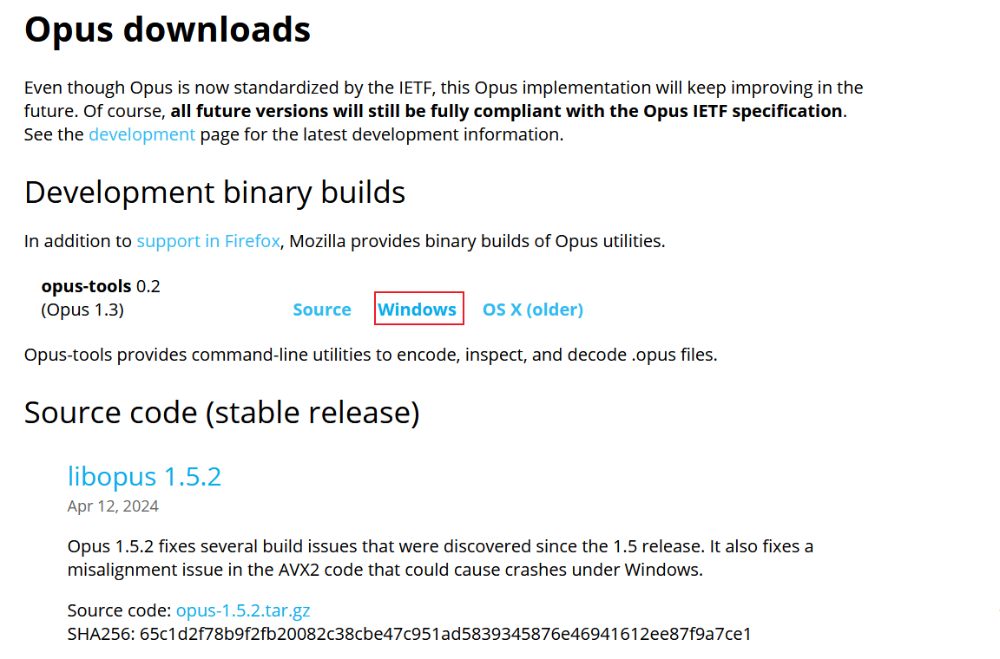

## opus音频的转换

在一些环境中（如游戏解包中），我们将会遇到.opus、.ogg、.wav这样的奇奇怪怪的音频格式。这篇文章记录了如何将此类格式的文件转换为mp3、flac等常见音频格式。


### 背景介绍
opus是一种音频编码格式，官网是https://www.opus-codec.org。它不能直接被市面上的播放器播放，也不能被处理。
#### 几个名词解释
opus：一种音频格式文件编解码器，也指这种音频格式。
opus-tools：为转换opus格式音频文件而开发的工具的统称，包含opusdec（opus 至 wav）、opusenc、opusinfo等工具。
lbopus：是opus编解码器（opus标准）的源码实现（不包含可执行文件）

你可以从[Opus documentation](https://opus-codec.org/docs/)看到对以上概念的介绍及文档。


### 已有方案的不足
笔者曾尝试过使用`ffmpeg`进行转换，但难度不小，尤其是对于windows用户来说。大部分的ffmpeg二进制版本都不支持opus类音频文件的编解码，需要我们自己进行手动编译。我曾尝试过使用mysys2在windows上进行编译，但遇到了各种奇奇怪怪的问题，最后宣告失败。（似乎linux会简单一些）编译的水很深，我不建议你尝试。

libopus有自己的python库，叫`opuslib`，但是并没有提供接口文档.我百度搜了一下发现，如果使用python大法的话还要处理音频采样率参数之类复杂的问题，最后当然也宣告失败。

### 解决方案
几番搜索之下，我终于在官网上找到了官方的编码与解码工具，说实话，这藏得够深的。
工具下载的链接：https://opus-codec.org/downloads/

点击下载opus-tool：


下载完成后，zip里面的`opusdec.exe`是解码工具，可以将opus文件转换为wav格式。
常用命令如下：
```
>>> opusdec.exe []

Usage: opusdec [options] input [output]

Decode audio in Opus format to Wave or raw PCM

input can be:
  file:filename.opus   Opus URL
  filename.opus        Opus file
  -                    stdin

output can be:
  filename.wav         Wave file
  -                    stdout (raw; unless --force-wav)
  (default)            Play audio

Options:
 -h, --help            Show this help
 -V, --version         Show version information
 --quiet               Suppress program output
 --rate n              Force decoding at sampling rate n Hz
 --force-stereo        Force decoding to stereo
 --gain n              Adjust output volume n dB (negative is quieter)
 --no-dither           Do not dither 16-bit output
 --float               Output 32-bit floating-point samples
 --force-wav           Force Wave header on output
 --packet-loss n       Simulate n % random packet loss
 --save-range file     Save check values for every frame to a file

```


### python批处理程序
我写了一个简单的批处理程序；将它与opusdec结合，可以批量把opus文件转换为wav文件。
源码及使用教程自取：
Github：[opus2wav](https://github.com/windlightly/opus2wav)