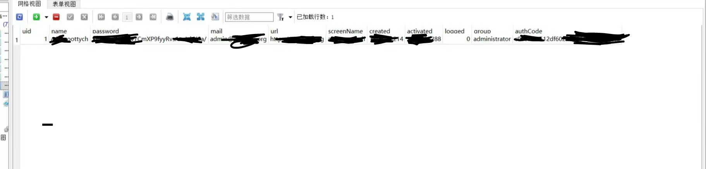
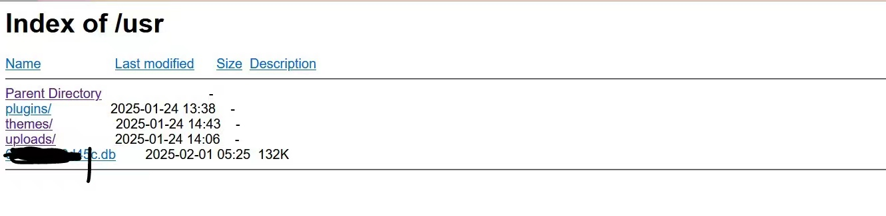
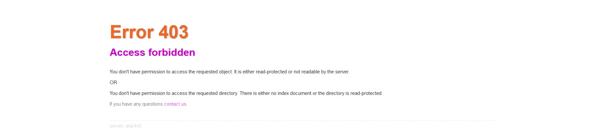

# serv00部署typecho不得不注意的安全事项
#### 省流：
1,在typecho安装向导中选择的sqlite数据库是由typecho自动生成的，此数据库除了密码之外的大部分数据，例如用户名，文章，评论预留的邮箱等均为明文存储。如果选择“远程链接数据库”并设置密码，则无此问题。在搭建个人博客的时候应该注意此安全问题。

2，serv00的默认的网络配置可能存在问题，即可以通过URL来直接访问敏感文件（例如数据库的.db文件）。
解决方案：在public_html或者你部署服务的根文件夹下新建文件名为“.htaccess”文件（或者上传在本地编辑好的文件也行），并写入以下内容：


```
RewriteEngine On

# 限制敏感文件的访问
RewriteRule \.db$ - [F,L] 

<Files ~ "^\.htaccess">
    Order allow,deny
    Deny from all
    Satisfy All
</Files>

## 关闭目录索引
<Files *>
Options -Indexes
</Files>


```
即可缓解问题。

#### 测试配置是否有效
在serv00的官方文档中，对于htacess文件是这么说的：
" The *.htaccess* file is supported on *PHP* type of website."
<br/>
所以对于其他非PHP项目或二进制部署文件，我也不知道使用此方法是否管用。所以在配置后应当进行测试，看是否可以通过URL访问敏感文件，如果返回错误，则说明配置应该起作用了。

<br/>


#### 以下为原文：

——----------------------------------------------------------
#### serv00部署typecho不得不注意的安全事项

如题


本人最近打算用serv00的服务器搭建一个typecho框架的个人论坛。

在搭的时候遇到了些奇奇怪怪的问题，于是便打开了typecho的Github项目页，想从issues里面找点解决方案。

但是我发现了这个东西：
[SQLite文件可直接被下载 #1806](https://github.com/typecho/typecho/issues/1806)


在这条被关闭的issue里面，反馈者发现可以通过输入格式为[主机名]+/user/+[str].db（typecho数据库的路径）的URL，即可直接下载typecho的sqlite数据库。

本人试了一下，发现真的可以。

进一步地，我想看看这个数据库是明文数据库还是被加密的数据库。于是我用SQLiteStudio打开了我在上一个步骤下载的数据库，发现确实是明文的.....

于是本人又查询了typecho的文档，
[Typecho数据库设计](https://docs.typecho.org/database)

发现存在数据库中的不仅有公开的文章，还有用户密码、评论，邮箱等信息。不过用户密码是加密的。




无独有偶，serv00的Apache http sever的配置似乎存在问题，导致外网可以直接访问数据库文件。
[NewApi .db 能直接下载](https://linux.do/t/topic/402126)


于是我去翻了serv00官方的技术文档，发现因它好像没有提供直接修改apache配置文件的途径。  我试着用ssh来访问配置文件所在的路径，但是显示权限不够。（我不太熟悉freebsd，如果可以修改serv00里面的httpd.conf的话，请告诉我）

[WWW Pages ——.htaccess](https://docs.serv00.com/htaccess/)

在官方文档里，它提供了这个来让用户自定义网络配置。

于是参考技术文档，本人摸索到了一个解决方案：

在public_html或者你部署服务的根文件夹下新建文件名为“.htaccess”文件
（或者上传在本地编辑好的文件也行），并写入以下内容：

```
RewriteEngine On

# 限制敏感文件的访问
RewriteRule \.db$ - [F,L] 

<Files ~ "^\.htaccess">
    Order allow,deny
    Deny from all
    Satisfy All
</Files>

## 关闭目录索引
<Files *>
Options -Indexes
</Files>


```
即可缓解问题。

#### 测试配置是否有效
在serv00的官方文档中，对于htacess文件是这么说的：
" The *.htaccess* file is supported on *PHP* type of website."
所以对于其他非PHP项目或二进制部署文件，我也不知道使用此方法是否管用。所以在配置后应当进行测试，看是否可以通过URL访问敏感文件，如果返回错误，则说明配置应该起作用了。

示例：
这是部署规则前：
输入域名/usr，会显示这样：



部署规则之后：

说明我们配置成功了。


